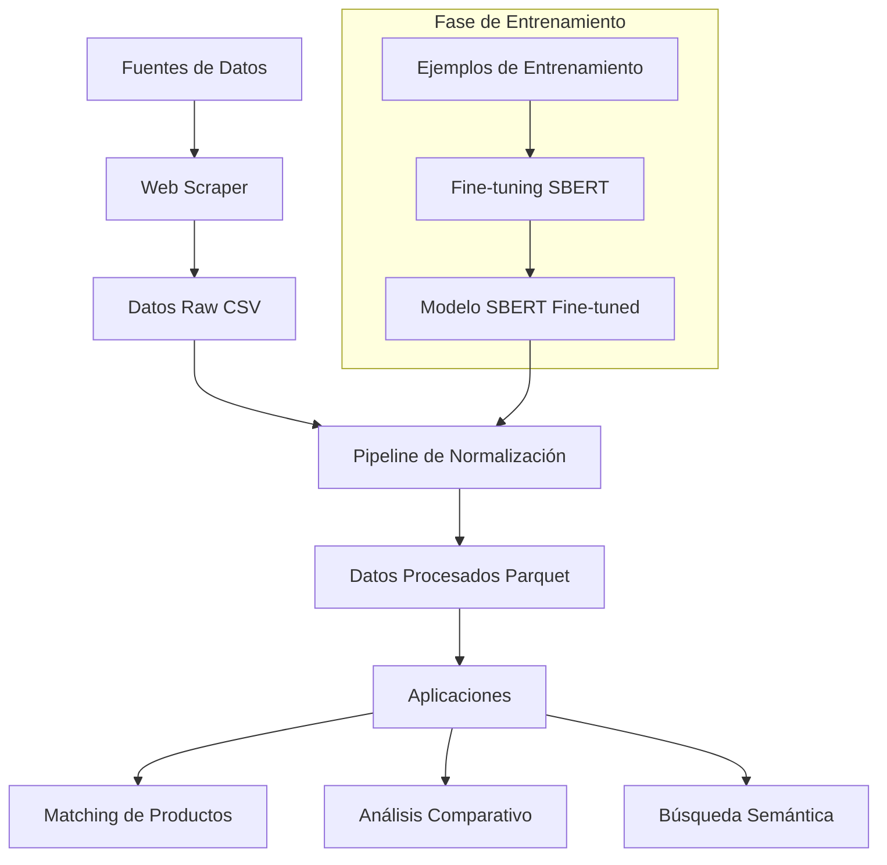
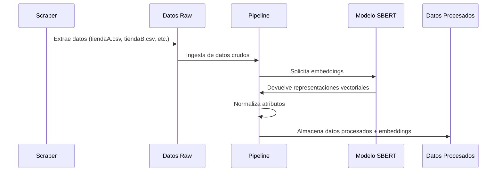
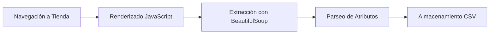
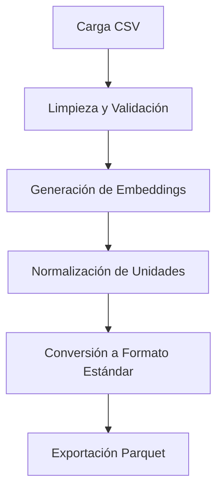
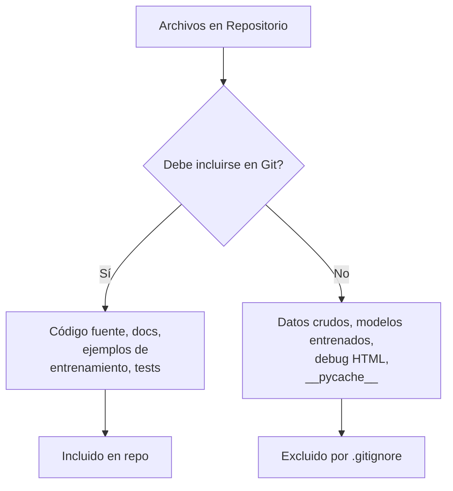

# Product Normalization Pipeline

Este repositorio proporciona un pipeline avanzado y reproducible para la normalización automática de datos de productos provenientes de múltiples fuentes, empleando técnicas modernas de Procesamiento de Lenguaje Natural (PLN) y aprendizaje profundo. El sistema integra modelos preentrenados y ajustados mediante fine-tuning de Sentence Transformers, permitiendo la obtención de representaciones semánticas optimizadas para el dominio de productos y facilitando tareas de matching, deduplicación y análisis comparativo a gran escala.

## Arquitectura del Sistema



## Flujo de Datos



## Características principales
- Normalización automática y configurable de atributos clave (descripción, marca, unidades, etc.).
- Utilización de embeddings semánticos optimizados mediante fine-tuning supervisado.
- Pipeline modular, reproducible y extensible, orientado a la integración en flujos de trabajo de ciencia de datos e ingeniería de IA.
- Soporte para almacenamiento eficiente y estructurado de datos enriquecidos (formato Parquet).
- Suite de pruebas automatizadas para validación de calidad y robustez del sistema.

## Configuración del Entorno

### Requisitos Previos
- Python 3.8 o superior
- Gestor de paquetes pip

### 1. Clonación del Repositorio
```bash
git clone https://github.com/username/product-normalization-pipeline.git
cd product-normalization-pipeline
```

### 2. Instalación de Dependencias
```bash
pip install -r requirements.txt
```

### 3. Estructura de Directorios
```
├── data/                  # Directorio de datos
│   ├── processed/         # Datos procesados y normalizados (Parquet)
│   └── raw/               # Datos crudos extraídos (CSV)
├── src/                   # Código fuente
│   ├── scraper.py         # Extractor web con BeautifulSoup/Playwright
│   ├── pipeline.py        # Pipeline principal de procesamiento
│   ├── normalizer.py      # Normalización de atributos de productos
│   ├── match_incremental.py # Matching semántico entre productos
│   └── utils.py           # Funciones auxiliares
├── tests/                 # Pruebas automatizadas
├── train_examples.jsonl   # Ejemplos para fine-tuning del modelo
└── train_product_sbert.py # Script de entrenamiento del modelo
```

## Flujo de Trabajo Recomendado

### 1. Extracción de Datos (opcional)
Si necesita extraer nuevos datos de las tiendas:
```bash
python src/scraper.py
```
Esto generará archivos CSV en `data/raw/` para cada tienda configurada.

### 2. Fine-tuning del Modelo (opcional)
Para ajustar el modelo a su dominio específico de productos:

```bash
python train_product_sbert.py
```

Formato del archivo `train_examples.jsonl`:
```json
{"texts": ["Café molido 500g", "Café 0.5kg"], "label": 1.0}
{"texts": ["Azúcar blanca 1kg", "Leche 1L"], "label": 0.0}
```

### 3. Ejecución del Pipeline
Para procesar los datos y generar representaciones semánticas:
```bash
python src/pipeline.py
```

### 4. Validación
Para ejecutar las pruebas automatizadas:
```bash
pytest tests/
```

## Componentes Principales

### 1. Web Scraper
Utiliza Playwright para renderizar páginas JavaScript y BeautifulSoup para extraer datos estructurados.



### 2. Pipeline de Normalización
Procesa y estandariza los atributos de productos usando el modelo semántico.



### 3. Modelo de Embeddings Semánticos
Modelo SBERT ajustado para reconocer similitudes semánticas específicas en productos.

## Ejemplo: Matching Semántico

```python
import polars as pl
import numpy as np
from sentence_transformers import SentenceTransformer

# Cargar modelo y datos
model = SentenceTransformer('product_sbert_model')
df = pl.read_parquet('data/processed/all_products_normalized.parquet')

# Convertir embeddings a matriz NumPy
embeddings = np.stack(df['embedding'])

# Ejemplo: Buscar productos similares a uno específico
producto_consulta = "Café molido 500g MarcaA"
emb_consulta = model.encode(producto_consulta)

# Calcular similitud por coseno
sims = np.dot(embeddings, emb_consulta) / (np.linalg.norm(embeddings, axis=1) * np.linalg.norm(emb_consulta))

# Mostrar resultados ordenados por similitud
indices = np.argsort(-sims)
for idx in indices[:5]:
    print(f"Similitud: {sims[idx]:.3f} | {df['producto'][idx]} | {df['marca'][idx]}")
```

---

## Consideraciones para Implementación

### Seguridad y Gestión de Archivos



### Troubleshooting

| Problema | Solución |
|----------|----------|
| Error al cargar datos anidados | Use formato Parquet en lugar de CSV |
| Modelo no encuentra patrones correctos | Ajuste ejemplos en `train_examples.jsonl` y reentrene |
| Errores en scraping | Revise archivos `debug_tienda_X.html` para analizar estructura |
| Falla el pipeline completo | Ejecute componentes individuales para aislar el problema |

### Extensiones y Personalización

1. **Nuevas Fuentes de Datos**:
   - Añada nuevos sitios al scraper adaptando los selectores CSS
   - Implemente conectores para APIs o fuentes estructuradas

2. **Mejora del Modelo**:
   - Añada nuevos ejemplos de entrenamiento específicos para su dominio
   - Experimente con diferentes modelos base de Sentence Transformers

3. **Integración con Sistemas**:
   - Use el módulo `match_incremental.py` para integrarlo en flujos de trabajo existentes
   - Genere APIs REST usando los componentes modulares

## Políticas de Contribución

1. **Pull Requests**: Asegúrese de que las pruebas pasen antes de enviar PR
2. **Estilo de Código**: Siga PEP 8 y documente nuevas funcionalidades
3. **Consideraciones de Seguridad**: No incluya credenciales ni datos sensibles
